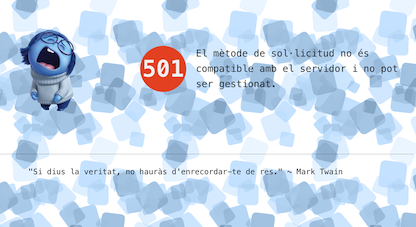

# Nginx multilingual HTTP Error Pages Replacement

The Nginx Error Pages project is a drop-in replacement of error pages.

## Features

* **Completely off-line functionality**. There is no dependence on an Internet connection for these pages to work. Everything is self-contained
* Fully responsive templates, **works across desktop, tablet and mobile** phones.
* **Maintenance Mode** with a specific 503 error page for maintenance.
* Multilingual support: ca,de,en,es,fr,it,pt. Default, en.

## Preview
Error 501 in catalan


Maintenance mode in Catalan


## Installation
Installing the drop-in replacement for Nginx error pages comes in two parts. First, you need to copy all the files contained within the `/error-pages/` folder to a location on your server. Second, you need to edit your `nginx.conf` or `modular.conf` files to link the error pages to your server installation.

### Copying the Error Pages
For this example we will assume that your Nginx default `www` folder is installed under `/usr/local/var/www/`. 

Do not replace the default error pages with this project's files. Instead, install them in a different, but accessible location that the Apache user can access. These commands will copy the project's error pages to your `www` folder.

```bash
$ cd InsideOut-Error-Pages/
$ cp -R error-pages/ /usr/local/var/www/error-pages
$ sudo chown -R _www:_www /usr/local/var/www/error-pages # see note below.
```
**Note: _Ensure that you replace `_www` in the `chown` command above, with your web-server's default user and group. This example is for Nginx under macos_**

### Modify Nginx config files
Open the file with your favourite editor.

```bash
$ sudo nano /usr/local/etc/nginx/nginx.conf
```
Scroll down until you find the `http` section in your conf file. First we must include the language map

```nginx
http {
	[...]
		# Language detection from header "Accept-Language"
		map $http_accept_language $lang {
		    default      en;
		    ~*^it        it;
		    ~*^pt        pt;
		    ~*^ca        ca;
		    ~*^es        es;
		    ~*^fr        fr;
		    ~*^de        de;
		    ~*(^en|,en)  en;

		    ~*,it        it;
		    ~*,pt        pt;
		    ~*,ca        ca;
		    ~*,es        es;
		    ~*,fr        fr;
		    ~*,de        de;
		}
	[...]
}
```
Into `server` section which could be under same file or loaded trough `sites-enabled` folder with links:

```nginx
server { 
	[...]
		error_page  400 /error-400.html;
		error_page  401 /error-401.html;
		error_page  403 /error-403.html;
		error_page  404 /error-404.html;
		error_page  408 /error-408.html;
		error_page  410 /error-410.html;
		error_page  414 /error-414.html;
		error_page  429 /error-429.html;
		error_page  431 /error-431.html;
		error_page  451 /error-451.html;
		error_page  500 /error-500.html;
		error_page  501 /error-501.html;
		error_page  502 /error-502.html;
		error_page  503 /error-503.html;
		error_page  504 /error-504.html;
		
		location ^~ /error- {
		  internal;
		  root /usr/local/var/www/error-pages/$lang;
		}
		
		# Uncomment for testing error pages
		location /get_error {return 501;}
	[...]
}
```

The folder for error pages will be defined according to language map to show message in the proper language.

## Configure maintenance mode

Into server section, just before error page reference include maintenance mode on Nginx configuration

```nginx
server { 
	[...]
	if (-f $document_root/maintenance.on) {
		set $maint_mode 1;
	}
	
	if ($remote_addr = 192.168.74.3) {
	    # disable maintenance mode for your IP (replace with your IP)
	    set $maint_mode 0;
	}
	
	if ($maint_mode) {
	    # return the 503 if we hit this block and maintenance mode is still on
	    return 503;
	}
	
	error_page 503 @maintenance;
	location @maintenance
	{
	  rewrite ^(.*)$ /maintenance-503.html break;
	  add_header Retry-After "604800";
	  root $_prefix/var/www/error-pages/$lang;
	}
	[...]
}
```
To activate maintenance mode only need to create an empty file with the name `maintenance.on` on your server root folder.

```bash
$ sudo touch /usr/local/var/www/html/maintenance.on
```

To deactivate, erase file or rename it.
